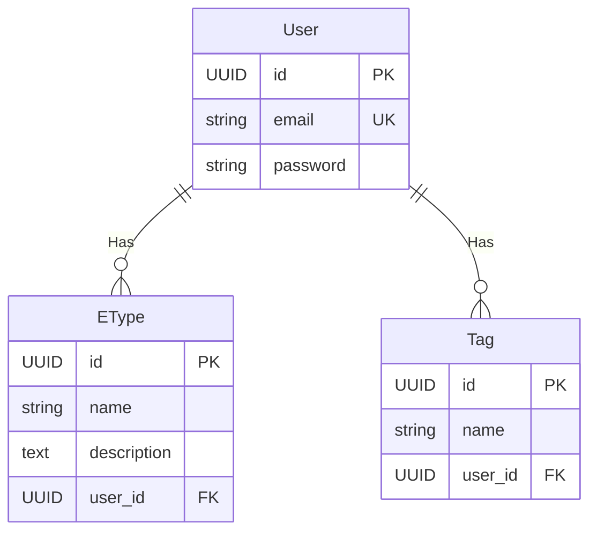

# Database
The project uses [SQLite](https://www.sqlite.org/). There are two databases:
- `../database/database.sqlite`: main production database
- `../database/database.testing.sqlite`: database for testing

The databases should be one level above the project directory so many copies/worktrees of the project could use the same database instance

## Structure

